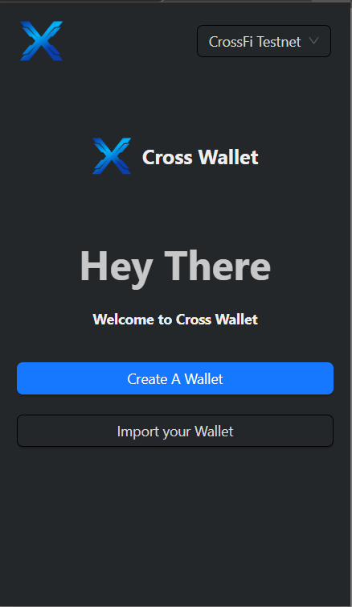
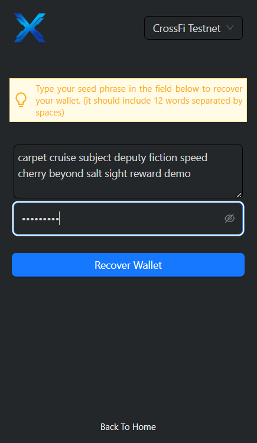
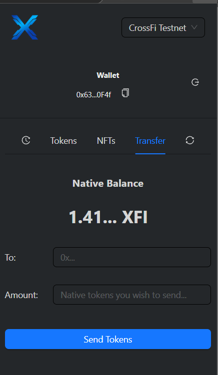
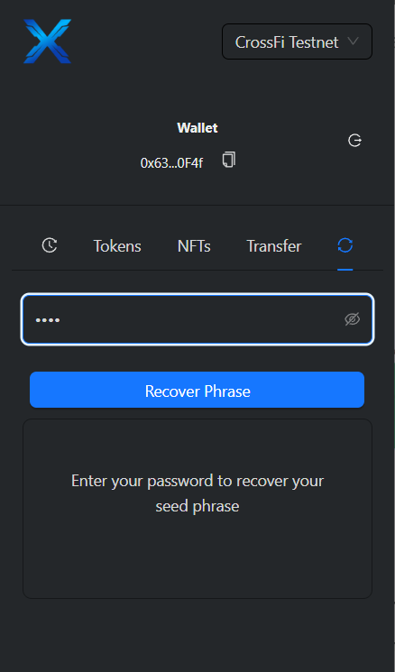

## Description
CrossX is a browser wallet extension designed to support native coin transactions on CrossFi and EVM-compatible chains. Currently, the wallet supports key functionalities like 12-word seed phrase security, sending and receiving coins, and fetching ERC-20 tokens and NFTs where applicable. While in its early phase of development, CrossX is positioned to evolve into a comprehensive solution that supports manual network additions and full EVM compatibility. The wallet provides a solid foundation for scaling to more complex DeFi use cases, ensuring that users can interact with multiple chains in a unified and secure manner.

## Problem Statement
As blockchain technology grows and diversifies, users are faced with the challenge of managing assets across multiple networks and protocols. Current wallets often lack interoperability, requiring users to use different wallets for different chains or perform complex tasks like manually adding networks and tokens. This fragmentation creates friction, reducing accessibility for both novice and advanced users.

## Solution
CrossX solves this problem by offering a crossFi wallet extension that enables seamless native coin transactions across CrossFi and EVM-compatible chains. Through an intuitive interface, users can easily manage their assets, send coins to any EVM address, and fetch ERC-20 tokens and NFTs. The wallet is designed to be secure, using a 12-word seed phrase for private key management, and provides a foundation for further integrations and enhancements like adding networks manually, supporting more EVM chains, and enhancing token compatibility.

## Screenshots

